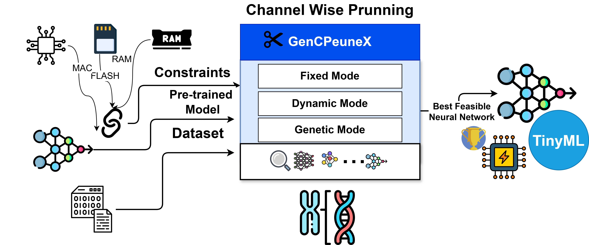

# GenCPruneX: Adaptive Channel-wise Pruning for Efficient TinyML Deployment with Genetic Multi-Objective Optimization

## 📄 Overview

**GenCPruneX**, an open-source structured pruning tool, is designed to optimize deep learning models for resource-constrained TinyML environments. Leveraging an L1 norm-based importance metric, it prunes channels and neurons to enhance efficiency. The tool supports sequential and linear feed-forward architectures, including MobileNet, the VGG family, and models built with TensorFlow. With Fixed, Dynamic, and Genetic pruning modes, GenCPruneX achieves significant resource savings while maintaining minimal accuracy loss, making it an ideal solution for TinyML applications.


<div style="text-align: center;">
  
  <p><em>Fig. 1 : Conceptual Diagram of GenCPruneX</em></p>
</div>

<!-- ## 📄 Paper Link

For more detailed information, you can read our full paper:

[TinyTNAS: GPU-Free, Time-Bound, Hardware-Aware Neural Architecture Search for TinyML Time Series Classification](https://arxiv.org/abs/2408.16535) -->


## 📑  Table of Contents 
- [Mode of Operation](#mode-of-Operation)
- [Installation](#installation)
- [Dataset](#dataset)
- [Usage](#usage)
- [Performance Summary](#performance-summary)
- [Contributors](#contributors)
- [License](#license)
<!-- - [Citation](#citation) -->
- [Contact](#contact)


<h2 id="mode-of-Operation">🚀 Mode of Operation</h2>


- **Fixed Mode**: In this mode, a consistent pruning ratio specified by the user is applied uniformly across all layers. This approach is well-suited for situations where a simple reduction in model complexity is needed to meet resource limitations. The process begins with a pre-trained model, its associated dataset, and a defined pruning ratio for all eligible layers. The result is a resource-efficient pruned model, tailored for deployment in constrained environments.
  
- **Dynamic Mode**: This allows for predefined, layer-specific pruning ratios, providing fine-grained control by enabling users to specify individual pruning ratios for each layer. Like Fixed Mode, it operates on a trained model and dataset but offers greater customization.
  
- **Genetic Mode**: This mode builds upon the inputs required for Dynamic Mode by incorporating hardware constraints such as RAM, MAC operations, and flash memory. Using a genetic algorithm, it dynamically identifies optimal pruning ratios for each layer, balancing accuracy with hardware limitations. Once these ratios are determined, the pruning is executed within the Dynamic Mode framework.


<h2 id="installation">🛠 Installation</h2>


1. Clone the repo:
   ```bash
   git clone https://github.com/BidyutSaha/GenCPruneX.git

2. Install dependencies:
   ```bash
   pip install -r requirements.txt

**Note:** The recommended Python version for this project is 3.8.19

<h2 id="dataset">📊 Dataset</h2>


- To get started with GenCPruneX, you can download the  datasets for time series classification that were used in this work.
  - Download the sample dataset from [this Google Drive link](https://drive.google.com/drive/folders/1UDP9QIzaFvy-k9eoO8ZrJo2NTHxVgelw?usp=sharing).

  - After downloading, unzip the dataset and place it in the `all_datasets/` directory  within the project folder.

  - Each `.npz` file from the sample dataset contains both features and labels.


    Here is an example of how to load the dataset files from `.npz`:

    ```python
    import numpy as np

    # Load training data
    train_data = np.load('all_datasets/train_data_UCIHAR.npz')
    X = train_data['features']
    Y = train_data['labels']

    # Load test data
    test_data = np.load('all_datasets/test_data_UCIHAR.npz')
    X_test = test_data['features']
    Y_test = test_data['labels']
    ```

 - For a subset of Visual Wake Word datasets-
   - Download the sample dataset from [this Google Drive link]( https://drive.google.com/drive/folders/1zr8wthXoBI9ACjOtGnZJl1_HT_xAjqzd?usp=drive_link).
   - After downloading, unzip the dataset and place it in the `all_datasets/` directory  within the project folder.
   - Each `.npz` file from the sample dataset contains both features and labels.
   - Here is an example of how to load the dataset files from `.npz`:

      ```python
      import numpy as np

      # Load training data
      train_data = np.load('all_datasets/train_dataset_VWW.npz')
      X = train_data['features']
      Y = train_data['labels']

      # Load test data
      test_data = np.load('all_datasets/validation_dataset_VWW.npz')
      X_test = test_data['features']
      Y_test = test_data['labels']
      ```
  
 - For custom datasets or alternative data sources, preprocess and format the (X,Y) and (X_test,Y_test) accordingly.


<h2 id="usage">📦 Usage</h2>

- Before applying channel or neuron-wise pruning in any mode, you must have a **trained model ready**. The trained model can be saved in a .h5 file and reused during the pruning process
  - For demonstration, we utilize MobileNet with an alpha depth multiplier of 0.25 as the backbone. A custom classifier head is added, and the model is trained on the Visual Wake Word Dataset. The implementation details for creating and training the base model are provided in the  [create-basemodel.py]( ./create-basemodel.py) script. 

- For **Fixed Mode**, you only need a trained model, the dataset, and a single pruning ratio, which will be uniformly applied across all prunable layers in the model. Refer to the    code snippet below for a quick guide, and check out the  [main-fixedPrune.py](./main-fixedprune.py) script for more details.


  ```python
    from cprunex import *
        
    # Load the Trained Model
    base_model = tf.keras.models.load_model("best_model.h5" )
    # Apply Pruning
    pruned_model= uniform_channel_prune(base_model, input_shape=(96,96,3), pruning_ratio=0.5, final_decision_layer_idx = 93)

    ```

- For **Dynamic Mode**, you need a list of pruning ratios for individual layers, along with the trained model and dataset. These ratios will be applied specifically to each prunable layer in the model. Refer to the code snippet below for a quick guide, and check out the [main-dynamicPrune.py](./main-fixedprune.py) script for more details.


  ```python
    from cprunex import *
        
    # Load the Trained Model
    base_model = tf.keras.models.load_model("best_model.h5" )
    # Apply Pruning
    ratios = [0.5, 0.9, 0.7, 0.2, 0.5, 0.3 ,0.1, 0.6 ,0.5, 0.9, 0.7, 0.9, 0.6, 0.7, 0.6, 0.4, 0.7, 0.9,
    0.8, 0.9, 0.6, 0.5, 0.3, 0.8, 0.3, 0.8, 0.4, 0.2, 0.9, 0.8, 0.3, 0.,  0.9, 0.9, 0.6, 0.2,
    0.4, 0.7, 0.8, 0.6, 0.9, 0.1, 0.1, 0.7, 0.8, 0.3, 0.8, 0.3, 0.7, 0.3, 0.,  0.9, 0.1, 0.2,
    0.7 , 0.1]
    pruned_model= custom_channel_prune(base_model, input_shape=(96,96,3), pruning_ratios=ratios)

    ```

- For **Genetic Mode**, this mode automatically determines the optimal pruning ratios for each layer using a genetic algorithm,    considering resource footprint constraints such as RAM, MACs, and Flash memory. It aims to maximize accuracy while adhering to these constraints. Once the pruning ratios are determined, the Dynamic Mode is used to perform pruning with these calculated ratios.

  In this mode, users need to set the resource constraints, including the maximum bounds for RAM, MACs, and Flash memory, along with providing the trained model and dataset.

  To execute this mode:

    - Run the script [main-geneticPrune.py](./main-geneticPrune.py).
    - For different experiments, modify the relevant variables in the [settings.py](./settings.py) script.
  
  A quick guide to the variables in [settings.py](./settings.py) is provided below.

  
  ```python
    # get the base model
    base_model =  tf.keras.models.load_model("best_model.h5" )
    base_model.summary()

    # Load the data
    loaded_train_data = np.load('./all_datasets/train_dataset_VWW.npz')
    x_train = loaded_train_data['images']
    y_train = loaded_train_data['labels']

    loaded_val_data = np.load('./all_datasets/validation_dataset_VWW.npz')
    x_test = loaded_val_data['images']
    y_test = loaded_val_data['labels']

    #set permitable hardware specs
    constraints_specs= {"ram"   : 75*1024,      # 'ram' in bytes
                      "flash" : 100*1024,       # 'flash' in bytes
                      "macc"  : 1.5*100*1000 }

    ```


<h2 id="performance-summary">📈 Performance Summary</h2>

The **GenCPruneX** framework was evaluated on the **Visual Wake Words (VWW)** dataset across three configurations: **Baseline**, **Fixed Mode**, and **Genetic Mode**. Resource constraints were applied only to the **Genetic Mode**, which automatically determines the optimal pruning ratios for each layer while adhering to the following hardware limitations:


- **RAM**: Maximum allowable RAM usage is **75 KB**.
- **Flash**: Maximum allowable Flash memory usage is **100 KB**.
- **MACs**: Maximum allowable multiply-accumulate operations are **1.5M** (1,500,000).

The table below summarizes the resource usage, accuracy, and efficiency improvements achieved:

| **Method**      | **Accuracy** | **RAM**    | **MACs**  | **Flash**  | **Latency (ms)** | **Energy (mJ)** |
|------------------|-------------|------------|-----------|------------|------------------|-----------------|
| **Baseline**     | 0.83        | 103.7 KB   | 7.5 M     | 322.7 KB   | 513.3            | 6.5             |
| **Fixed Mode** (0.5 as pruning ratio)  | 0.82        | 72.7 KB    | 2.2 M     | 118.9 KB   | 224.2            | 2.5             |
| **Genetic Mode** | 0.80        | 70.3 KB    | 1.4 M     | 84.8 KB    | 109.1            | 2.3             |

### Key Insights:
1. **Baseline** achieves the highest accuracy (0.83) but consumes the most resources, violating the constraints required for resource-constrained devices.
2. **Fixed Mode** significantly reduces resource usage while maintaining high accuracy (0.82), but it does not consider specific hardware constraints.
   -  This Mode reduces RAM by 29.9%, MACs by 70.6%, Flash memory by 63.2%, latency by 56.3%, and energy consumption by 61.5%, with a minimal accuracy drop of 1.2% (from 0.83 to 0.82).
3. **Genetic Mode** satisfies the applied hardware constraints, achieving the lowest resource footprint:
   - **RAM**: 70.3 KB (meets the 75 KB constraint)
   - **MACs**: 1.4M (meets the 1.5M constraint)
   - **Flash**: 84.8 KB (meets the 100 KB constraint)
   - The Genetic Mode reduces RAM usage by 32.2%, MACs by 81.3%, Flash memory by 73.7%, latency by 78.7%, and energy consumption by 64.6%, with only a 3.6% reduction in accuracy (from 0.83 to 0.80).


<h2 id="contributors">🤝 Contributors</h2>

We appreciate the efforts of everyone who has contributed to this project. Below is a list of contributors:
 - **[Bidyut Saha](https://www.linkedin.com/in/sahabidyut/)**
 - **[Riya Samanta](https://www.linkedin.com/in/riya-samanta-19774a1a5/)**
 


<h2 id="license">🔗 License</h2>

This project is licensed under the MIT License with a Non-Commercial Clause. The software is provided for research and non-commercial purposes only, and proper attribution must be given by citing our paper:

For more details, see the [LICENSE](LICENSE) file.


<!-- <h2 id="citation">📄 Citation</h2>

If you find this project useful, we kindly ask you to cite our paper:

    @misc{saha2024tinytnasgpufreetimeboundhardwareaware,
          title={TinyTNAS: GPU-Free, Time-Bound, Hardware-Aware Neural Architecture Search for TinyML Time Series Classification}, 
          author={Bidyut Saha and Riya Samanta and Soumya K. Ghosh and Ram Babu Roy},
          year={2024},
          eprint={2408.16535},
          archivePrefix={arXiv},
          primaryClass={cs.LG},
          url={https://arxiv.org/abs/2408.16535}, 
    } -->


<h2 id="contact">📧 Contact</h2>

If you have any questions or collaboration needs (for research or commercial purposes), please email `sahabidyut999@gmail.com` or `study.riya1792@gmail.com`
